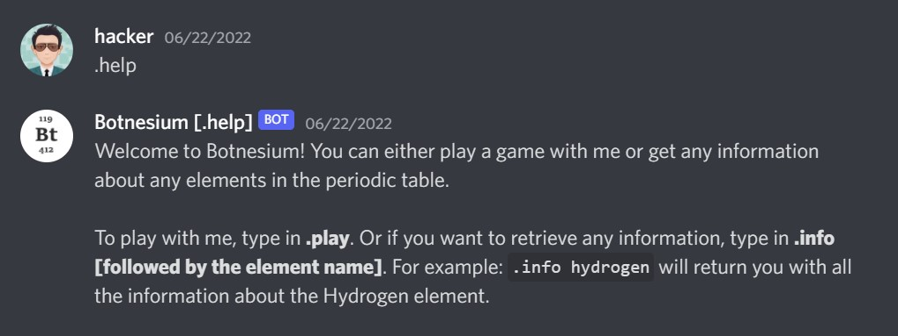
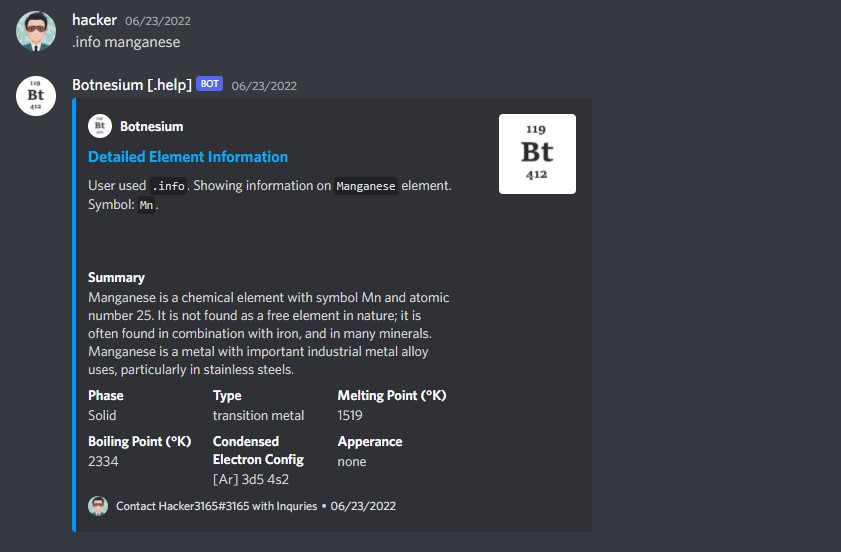
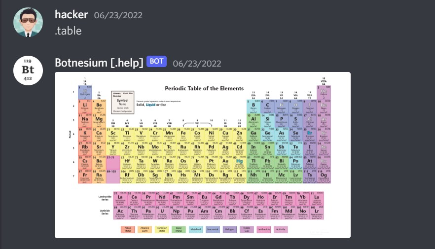
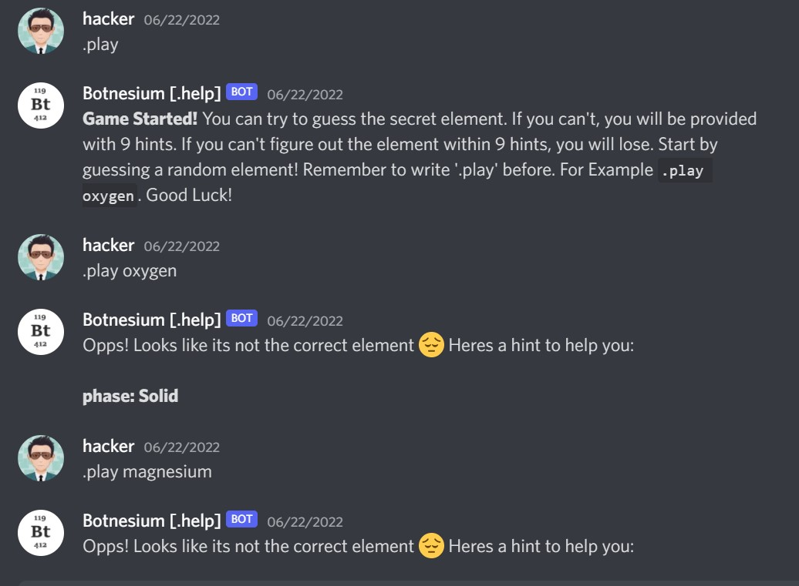

## Botnesium -- A Discord Bot to Make Chemistry More Fun!
---

##### Botnesium was made possible using Discord.js. The purpose of this bot was to provide the user with information about any elements from the periodic table. For instance, if an user types `.info [element name]`, botnesium sends a message to that channel with the most important informations about that element, such as, it's symbol, melting and boiling point, molar mass, type, and a summary of that element. The bot can also send an picture of the periodic table, which allows the user to have instant access to the table when they need it. Moreover, it is also capable of playing with the user. For example, the bot will select a random element from the periodic table and give the user hints for the user to guess it. If the user guesses the right element within 10 tries, the user wins. 
---

### How the Bot Works:
---
##### Whenever the bot is online, it will scan every message an user sends to that channel and if any message starts with the keywords `.help`, `.play`, `.table`, or `.info [element name]`, the bot will act respectively. Botnesium is connected to a specific server using a token and a client key which are kept secret. However, the bot has to be manually tured on using `node app.js` and it is not ready to be added to other servers yet. **The bot gets the data from a json file which was retreived from another github repository.**
---

### Usage:
Here are a few different screenshots from Botnesium:

The following image describes the role of `.help` command:
 
The following image describes the role of `.info [element name]` command:
 
The following image describes the role of `.table` command:
 
The following image describes the role of `.play` command:

